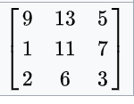
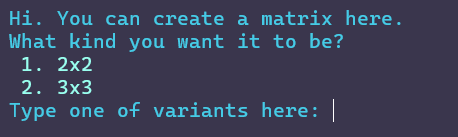
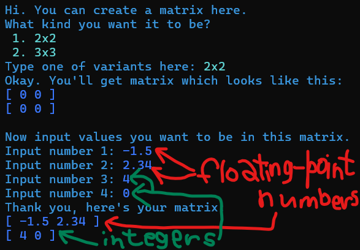
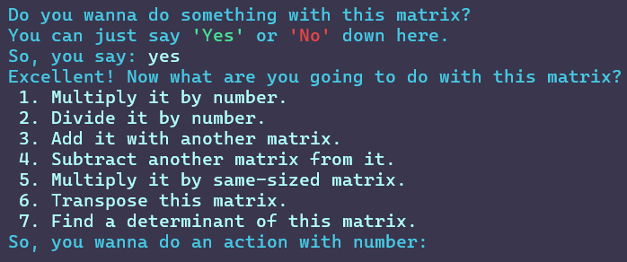

# What is a matrix?

Put simply, matrix is some kind of a rectangular grid with values that can have different size, depending on how much rows and columns it has.
For example,\
\
is a matrix, that has 3 rows and 3 columns.\
Matrix that has equal number of rows and columns is called **square matrix**.

# About my project

As you can see, my project works with square matrices of sizes 2x2 and 3x3 only:\
\
You can choose size just by typing `2x2` or `3x3`.
After choosing the size, you must input numbers that your matrix will have.
Array that contains them is of `float` data type, so you can even write numbers with decimal point(aka **floating-point numbers** or simply **FP numbers**):\

### Actions with matrices

After you fill matrix with numbers, program will ask you: `Do you wanna do something with this matrix?`\
You can just type `Yes` or `No` here.\
If you said yes, then program will offer you a list of operations you can do with matrix:\
\
You can choose operation by just inputing its number from the list.

Now, I will tell you here what every operation means:\
**1. Multiplying**: Every number of matrix gets multiplied by number that you input. Yeah, it's this simple. Number can be FP, by the way.\
**2. Division**: Same as multiplying, but you divide by number.\
**3. Adding with another matrix**: You create another matrix, then corresponding numbers of both matrices add, creating new matrix.\
**4. Substracting from another matrix**: Same as adding, but you subtract one matrix from another.\
**5. Multiplying by another matrix**: Actually, it's a really complex operation. You can read more here: https://en.wikipedia.org/wiki/Matrix_multiplication. But, as you can guess, you have to create another matrix.\
**6. Transpose**: Numbers of rows swap with numbers of columns.\
**7. Calculating determinant**: https://en.wikipedia.org/wiki/Determinant.

# Known flaws

- It only works with 2x2 and 3x3 matrices;
- Matrices and determinants look messy when you fill them with numbers of different length;
- Code has a lot of `<chrono>`, `<thread>` and color code crap that is painful to read.

Despite these flaws, I hope you'll like my work :3

- Ki Maru.
